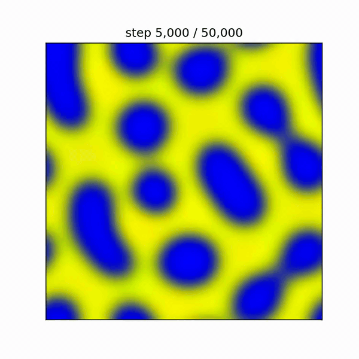

# Phase-field modeling of multicomponent phase separation in JAX

JAX implementation of differentiable phase-field simulations for multicomponent liquid mixtures, based on the phase-separation model described in [Shrinivas & Brenner PNAS (2021)](https://www.pnas.org/doi/10.1073/pnas.2108551118). Includes code to reproduce results from the original paper, as well as extensions to nonreciprocal interactions, chemical reactions, and Brusselator/Belousov-Zhabotinsky-style reaction-diffusion scenarios.

    

## Contents

- `jax_phase_separation/`: simulation and analysis code
- `notebooks/original_paper/`: notebooks to reproduce figures from the Shrinivas & Brenner paper
- `notebooks/extensions/`: inverse-design and extensions to nonreciprocal interactions and reaction-diffusion

---

## References

[Shrinivas & Brenner PNAS (2021)](https://www.pnas.org/doi/10.1073/pnas.2108551118)
- see associated [Github repository](https://github.com/krishna-shrinivas/2021_Shrinivas_Brenner_random_multiphase_fluids)